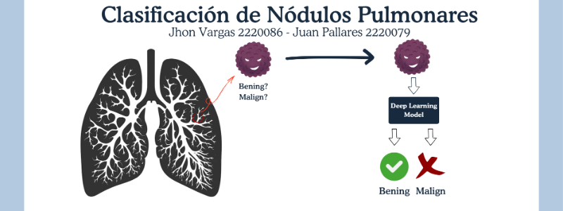

# Clasificación de Nódulos Pulmonares

## Autores
Jhon Anderson Vargas Gomez, Juan David Pallares Pallares

## Objetivo
Clasificar nódulos pulmonares a partir de parches extraídos del dataset LIDC-IDRI.

## Dataset
**LIDC-IDRI** — conjunto de tomografías torácicas con anotaciones de radiólogos.  
**Descarga:** https://wiki.cancerimagingarchive.net/display/Public/LIDC-IDRI

## Modelos
- CNN  
- Transfer Learning  
- Data Augmentation  
- DNN
- Autoencoder Anómalo  

## Enlaces
- **Video:** https://www.youtube.com/watch?v=w0xsCpMtucI
- **Repositorio:** https://github.com/Lucky0nTop/IA-2
